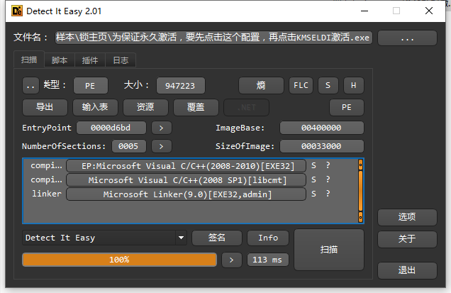
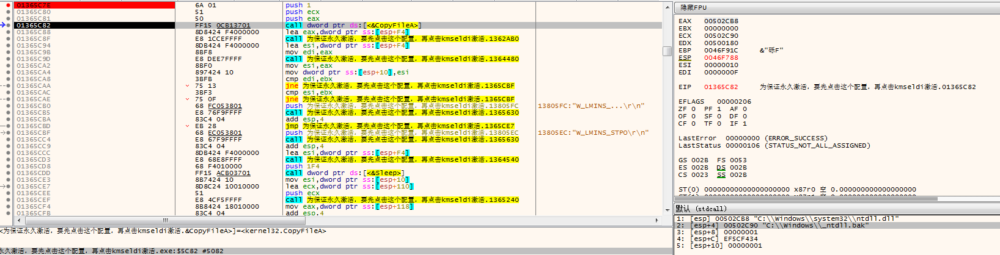
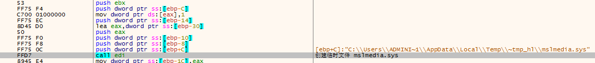
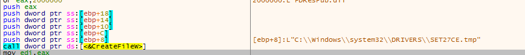
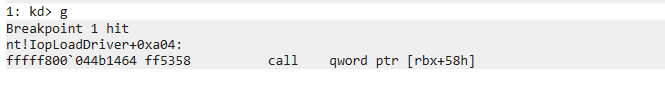
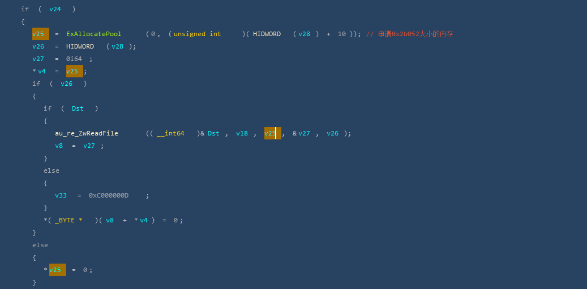

# 

前段时间帮朋友激活电脑.下载了一个激活工具后,发现浏览器被锁主页了.\
激活工具删掉也还是被锁.用PCH看了下发现有伪装成微软的驱动程序注册镜像加载回调和minifilter.作为一个内核初学者,尝试分析一二.

## 0.恶意行为

锁主页

被锁的主页还不是固定的.朋友电脑上被锁的是2345.怀疑有网络通讯.

注册miniFilter\

注册系统回调\

## 1.基本信息分析

二话不说先DIE\

显示32位程序,无壳\
拖到IDA里看下流程.\
加载过程中发现PDB信息.\

程序入口\

发现创建窗口前调用了一些函数.我们暂时只是看下流程.不过多关心细节.\
接下来看注册窗口类的窗口过程函数.\
\
\

发现有获取目录,文件操作,服务操作,资源操作等相关的函数.\
因为有加载驱动,所以这些操作基本符合预期.

## 2.行为监测

接下来用火绒跑一波行为.(这里仅列出了Ring3的行为)

\
\
发现有拷贝文件,创建文件,释放驱动的操作.\
然后动态分析看一下

## 3.Ring3程序动态分析

拷贝文件:\

打开服务:\
\
如果服务不存在,创建日志文件

创建`hllog.txt`文件并写入信息\
\
该文件经过测试是日志文件\

加载资源:\

获取自身文件句柄:\

读取自身到内存:\

数据分了两块内存.文件最后0x1000大小的数据单独存放.\
\

创建`setupsti.log`文件\
\
写入0x00110048大小的数据到该文件:\

创建临时`inf`文件:\
\

文件内容如下:\
\
可以看出来是个`minifilter`的inf文件

创建驱动文件:\
\

驱动目录下创建临时文件:\

安装设备驱动:\

打开服务:\

启动服务:\

查询服务状态:\

接着会再次把信息写入日志文件\

然后结束当前进程.
Ring3的分析到此就结束了.因为有备份ntdll.dll,猜测应该还有一些注入的操作.时间关系就不分析了.接下来分析Ring0的驱动程序.

## 4.Ring0分析

查看签名:\
\
上海域联,常见的被用烂了的过期签名.

DIE:\

显示无壳.直接IDA了.\
拖入IDA会发现一个比较奇怪的地方.\
\
\
看入口应该是没有加壳的.但是导入函数只有这么几个.没有找到注册minifilter和设置Loadimage回调的函数.但是有多个申请内存,读写文件的操作.猜测是不是有`内存加载驱动`.

Windbg调试起来:\
\
因为是我win7系统,调用DriverEntry是IopLoadDriver+0A04的位置.

\
\
在sub_11AD8中有一次申请大内存然后读文件的操作.\
然后解密数据.\
\
解密后,发现明显的PE文件特征.\

然后会判断是否是PE文件,是PE文件进入加载流程.\
\
\
\

下面分析dump出来的sys:\
\
无壳.IDA看一下:\
\
\
